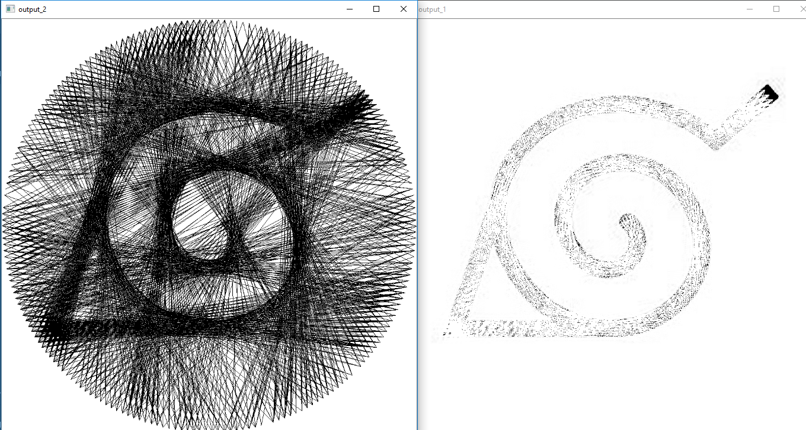
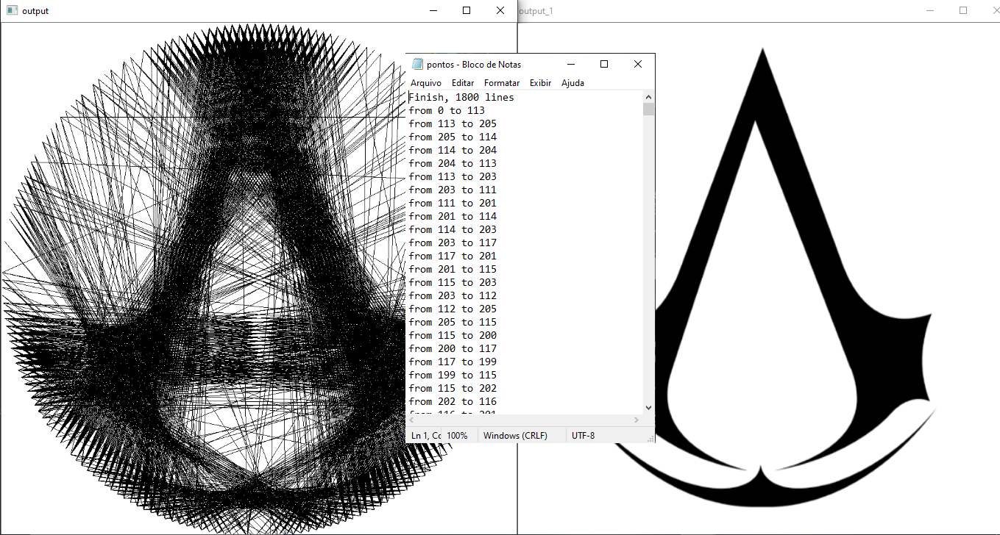

# python_weaver

Forme imagens por meio de linhas

Algoritmo Desenvolvido em Python 3.7 , utilizando PyCharm como IDE com o intuito de aprendizado

Programa realizado com base no video sobre o mesmo porem em C++ do canal [Universo Programado](https://www.youtube.com/watch?v=YZtx4jNNbx8&t=252s)

## Bibliotecas

As bibliotecas utilizadas foram:
* Nativas
   * Tkinter
   * Math
* Externas
   * OpenCV

Para instalação do OpenCV execute no terminal o comando `pip install opencv-python`

## Execução

para executar o código via terminal, por meio dele navegue até o diretório em que código se deposita e execute o comando `python wheaver.py`

**Obs:** Devido a não compatibilidade da biblioteca OpenCV com o formato UTF-8, não utilize nenhum diretório com caracteres como **ç**, **~**, **^**, **´**, entre outros...

## Imagem

O programa abrira uma janela para selecionar uma imagem

A imagem em si deve ter certos requisitos...

Afim de manter a uniformidade do circulo, a imagem deve ter altura e largura identicas

Para melhor experiencia utilize imagens entre 500x500 a 1000x1000 pixels

## Pregos

O algoritimo lhe permitira escolher o numero de pregos a serem utilizados o recomendavel são 210 pregos

## Processo

O programa levara um tempo para processar toda a imagem o que pode variar conforme o arquivo

O algoritimo irá ler a partir de um ponto, uma linha de pixels até outro ponto, fara isso para todos os outro pontos, será traçada um linha até o ponto que mais tiver pixels preto e o processo irá se repetir apartir deste novo ponto e assim seguira até não haver mais pixels pretos entre os pontos ou atingir o numero de 1800 linhas

O limite de linhas atualmente é fixo em 1800...

## Salvamento

Após o processo ser finalizado o será informado o termino no terminal e uma janela identica será aberta, identificando o final do processo para poder observalo, apertando qualquer tecla ou propriamente fechando a imagem, será aberta uma janela para salvar os caminhos de ponto a ponto, escolha o local e digite o nome do arquivo, não informe a extensão, a extensão .txt já está configurada como padrão.

